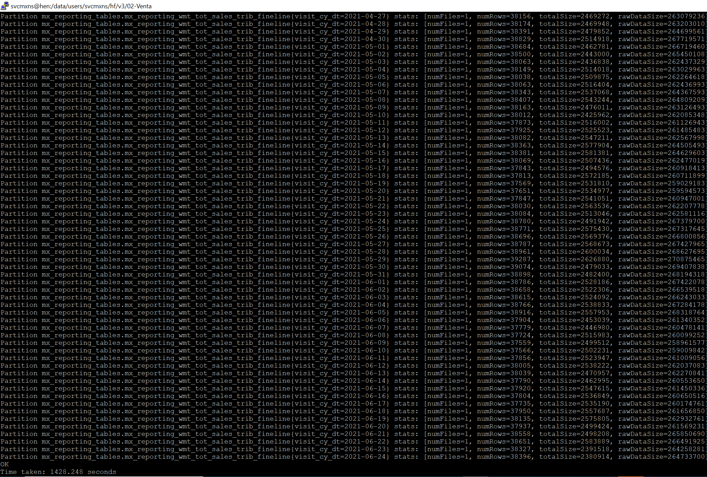
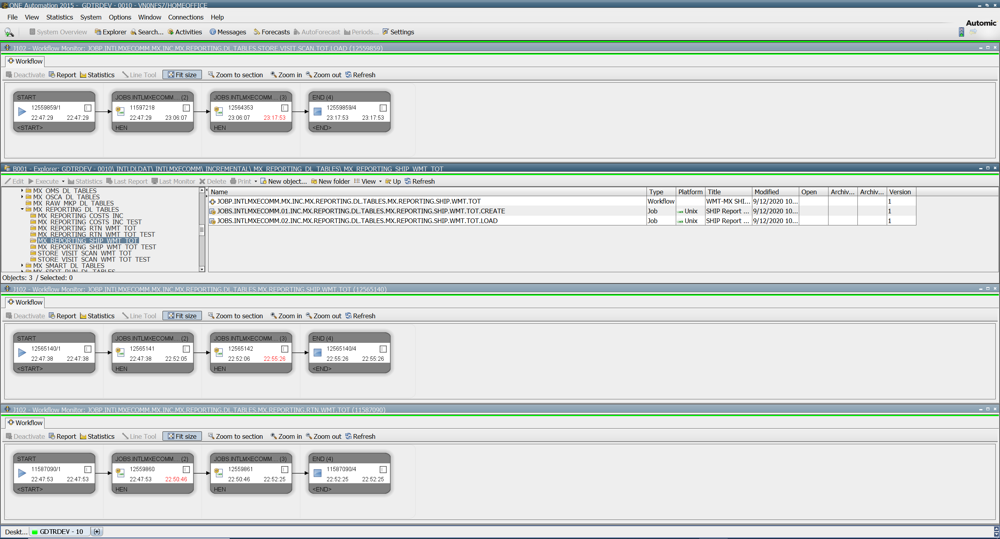
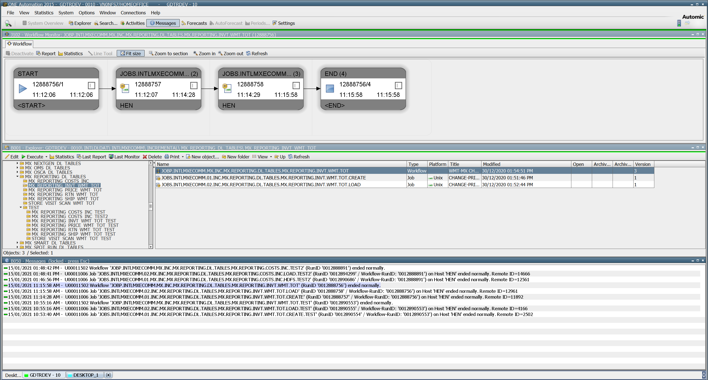
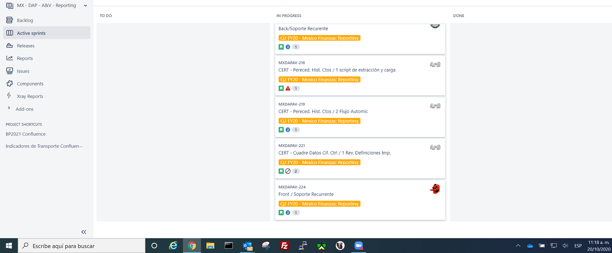
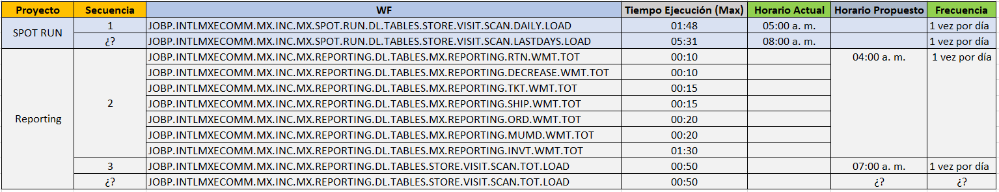
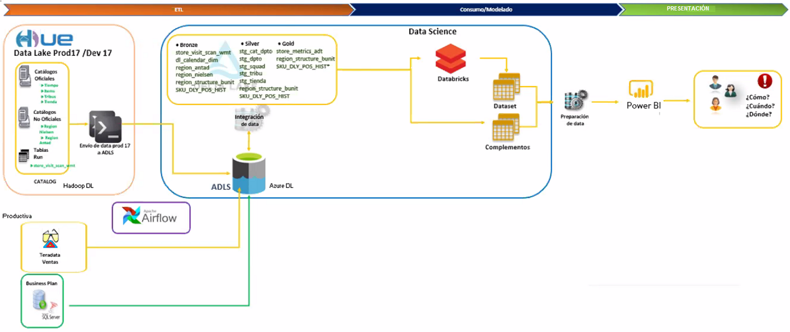
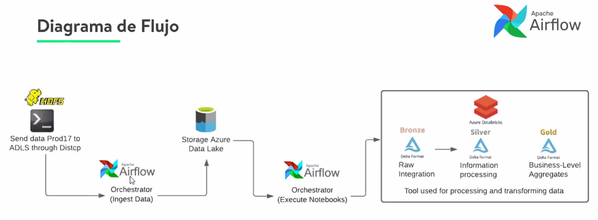
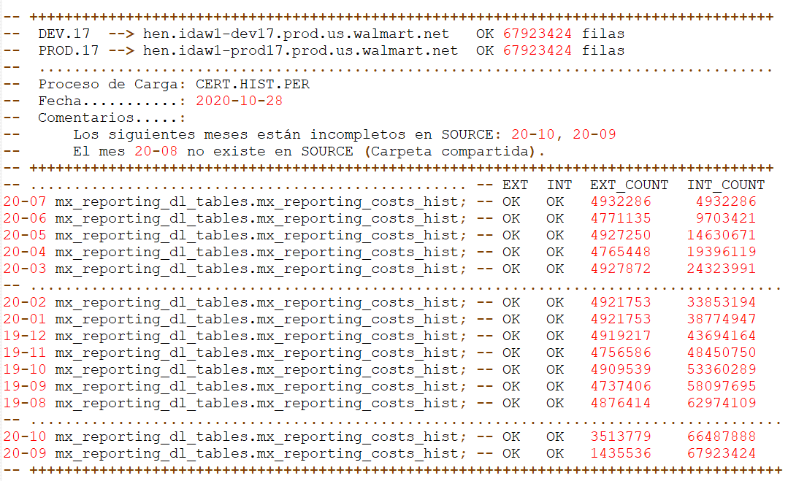
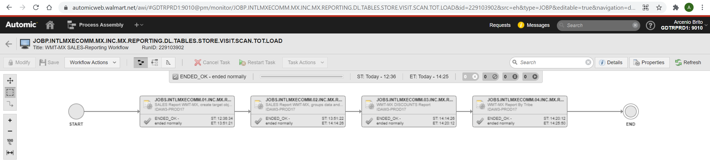
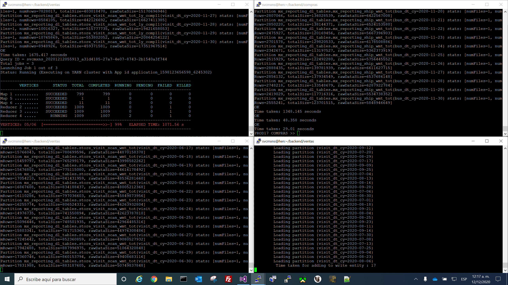

# Big Data Processing in Large Production Environments

Big data processing in large-scale production environments, such as those seen in Walmart and other global enterprises, involves handling massive volumes of diverse data with precision and efficiency. This document outlines some components, tools, and practices used in such environments to provide guidance/visibility about real industrial-grade data engineering systems.

## Data Engineering

Data engineering involves designing and building pipelines, scripts, storage systems that transform raw data into structured and usable formats. 

### Key aspects include:

- Data ingestion from multiple sources (e.g., transactional databases, IoT devices, and third-party APIs).

- Data cleaning and transformation to maintain quality and consistency.

- Ensuring scalability and reliability to handle millions of daily transactions.

## Hadoop Data Lake

A Hadoop Data Lake serves as the central repository for storing all organizational data in its raw or semi-structured form. It enables:

- Scalability to handle petabytes of data.

- Support for various data types, including structured, semi-structured, and unstructured data.

- Integration with big data processing tools like Hive, Spark, MapReduce, etc.

## HDFS File System

The Hadoop Distributed File System (HDFS) is a key component of the Hadoop ecosystem. It provides:

- Fault tolerance: Automatic replication of data across multiple nodes.

- High throughput: Optimized for streaming large datasets.

- Cost-effectiveness: Optimizes the hardware to reduce infrastructure costs.

## Hive SQL Language

Hive provides a SQL-like interface to query data stored in the Hadoop ecosystem. Its power relies in:

- Simplifying big data analysis for users familiar with SQL.

- Supporting complex queries for analytical processing.

- Allowing integration with visualization tools like Tableau and Power BI.

### Key Features of Hive:

- **Scalability**: Processes terabytes or petabytes of data.

- **Integration**: Works with HDFS and supports various file formats (e.g., ORC).

- **Optimization**: Query execution plans can be fine-tuned for performance.

## Designing Hive Tables

Hive tables are designed to store massive datasets efficiently. Key considerations include:

1. **Optimization**

  - Use columnar storage formats (e.g., ORC, Parquet) to reduce storage size and improve query performance.

  - Partition tables to enable faster query filtering. For example, a transaction table could be partitioned by date or region. *Data partitioning involves dividing a dataset into smaller, more manageable subsets based on a specific criterion, usually a column or attribute.*

  - Bucketing can help to optimize joins and aggregations. *Bucketing improves query performance by grouping similar data together and reducing the number of files to scan during processing.*

2. **Handling Diverse Data Sources**

   Hive tables integrate data from various sources, such as:

  - Transactional tables from relational databases.

  - XML and JSON files for semi-structured data.
  
  - Excel, MS-Access, csv files among other flat files.
  
  - Datawarehouses like Teradata, API-services, Denodo, ...

3. **Non-Relational Design**

  - Hive tables are non-relational due to the volume of data they handle. 
  
  - Unlike traditional/transactional databases, Hive prioritizes scalability and performance over strict relational consistency.

## Automic Workflows

Automic workflows orchestrate and automate the execution of data processing tasks in production environments. They provide:

  - Dependency management: Ensures tasks are executed in the correct order.

  - Retry mechanisms: Automatically re-executes failed tasks to handle transient errors.

  - Scheduling: Runs workflows at specific times or triggers them based on events.

## Automic Broadcom

Broadcom company provides industrial grade automation tools like **Autosys** ─used in support engineering to manage/control process/jobs─ and **Automic** to streamline operations in big data environments. 

## Focus on Optimization in Data Lakes

In data lake environments, much of the effort is dedicated to optimizing:

- Processes: Through the improvement/optimization of ETL-workflows for speed up, and make the batch-processing more efficient and reliable.

- Scripts: Ensuring code efficiency to handle large-scale data processing.

- Workflows: Reducing constraints and improving resource utilization.

Optimization ensures that the infrastructure can handle the ever-growing demands of big data processing while keeping costs manageable.

These technologies are used by large transactional companies like Walmart to handle daily big data processing requirements extracting valuable insights from their data lakes, enabling informed decision-making at such large scale.

See: [Hadoop / Hive Features](./hadoop-hive.md)

___

## Screenshoots
___

___

___

___

___

___

___

___

___

___

